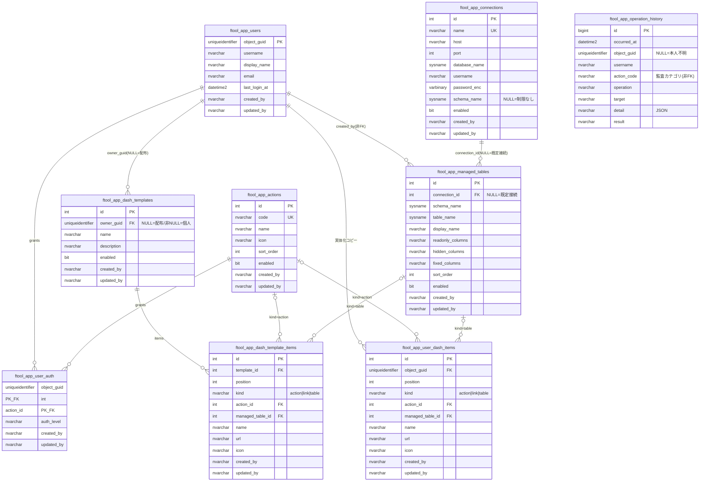

# DB スキーマ(ftool_app_\* テーブル)

本ツール自身のテーブルの全体像。DDL の正は
[`deploy/initdb/01_init.sql`](../deploy/initdb/01_init.sql)(開発)と
[`deploy/initdb/prod-app-schema.sql`](../deploy/initdb/prod-app-schema.sql)
(本番。内容は同一に保つ)。管理対象の業務テーブル(`dbo.products` 等)は
含まない — それらは `ftool_app_managed_tables` に「登録」されるだけで，
スキーマ自体は本ツールの管理外(実行時にカタログから読む)。

## 命名規約(2026-07-22 決定，S41)

- **テーブル接頭辞は `ftool_app_`**(`app_` 単体だと業務テーブル側の命名と
  衝突しうるため)。制約名・インデックス名も同じ接頭辞で揃える
  (`pk_ftool_app_actions` 等)。
- **`created_by` / `updated_by`** を可能な限り全テーブルに持たせる
  (実際に登録・変更した人の username)。例外は `ftool_app_operation_history`
  のみ(追記専用ログで `username` 列が実質 `created_by` を兼ねるため)。
- **`ftool_app_operation_history.action_code`** は「監査カテゴリ」であり
  `ftool_app_actions` への FK ではない(意図的)。機能マスタのコード
  (`table-maint` / `settings` / `history`)に加え，機能マスタに存在しない
  疑似カテゴリ(`auth` = ログイン/ログアウト，`dashboard` = 個人ダッシュボード
  操作)も入るため，カテゴリの粒度が機能マスタと別軸になっている。

## ER図

## テーブルの役割

| テーブル | 役割 |
|---|---|
| `ftool_app_users` | LDAP 認証成功時に自動登録されるユーザー台帳。キーは AD の objectGUID |
| `ftool_app_actions` | 機能マスタ。ダッシュボードのカードの元になる。行の追加・削除は API に無い(コード実装+シードのみ。全行が常に組込) |
| `ftool_app_user_auth` | ユーザー×機能ごとの権限レベル(admin/maintainer/user)。行が無い機能は権限なし |
| `ftool_app_connections` | 管理対象テーブルの接続先(既定接続=アプリ自身のDBは含まない)。パスワードは AES-GCM 暗号化 |
| `ftool_app_managed_tables` | テーブルメンテナンスの管理対象登録。実テーブルのメタデータは毎回カタログから取得 |
| `ftool_app_operation_history` | 全操作の監査履歴(追記専用) |
| `ftool_app_dash_templates` | ダッシュボードテンプレート。`owner_guid` が NULL なら管理者配布，非NULL なら個人所有 |
| `ftool_app_dash_template_items` | テンプレートの構成項目(機能ショートカット/URL リンク/テーブルショートカット) |
| `ftool_app_user_dash_items` | ユーザー個人の「現在のダッシュボード」の実体化コピー(下記) |

## ダッシュボードの実体化コピー方式(2026-07-22 決定，S41)

以前は「選択中テンプレートID + 並び順 + 非表示キー」を `app_user_dash` が持ち，
個人カードは別テーブル `app_user_links` が持つ2系統の設計だった。S41 で
`ftool_app_user_dash_items` 1本に統合し，「ユーザーが今見ているダッシュボード
そのもの」を position 順の実体として保持する方式に変更した。

- **0件 = 空のダッシュボード**(2026-07-23 改定): 権限のある全機能への自動
  フォールバックはしない(ユーザーが明示的に操作するまで表示は変わらない)。
  テンプレート選択の「既定」で，その時点で権限のある全機能を実体化コピー
  できる(以後の権限変更には追従しない)
- **1件以上**: サーバーの項目を position 順にそのまま表示
  (権限を失った action/table 項目は描画時にフロントが除外するだけで，
  行自体は削除しない — 権限が戻れば再表示される)
- **テンプレート適用は全置換**: 選択したテンプレートの項目をコピーして
  `PUT /me/dash-items` で丸ごと置き換える。カスタマイズ済みの内容は失われる
  (事前に「現在の構成を保存」で個人テンプレートへ退避できる)
- **配布テンプレートの更新・削除は適用済みユーザーへ波及しない**
  (コピーであってテンプレートへの参照ではないため)
- 並べ替え・カード追加・カード削除もすべて `PUT /me/dash-items` の全置換で
  実装している(部分更新 API は無い)

この設計変更にともない，フロントのカードキー体系も
`fn:<code>` / `mylink:<id>` / `tpl:<itemId>` の3系統から **`item:<id>` の1系統**に
単純化した(2026-07-23 の既定表示フォールバック廃止により `fn:<code>` も消滅)。
